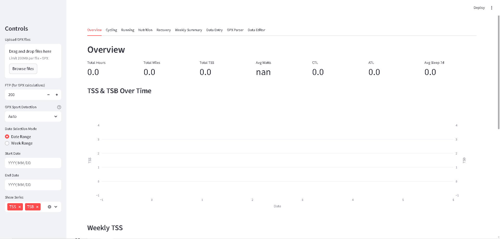
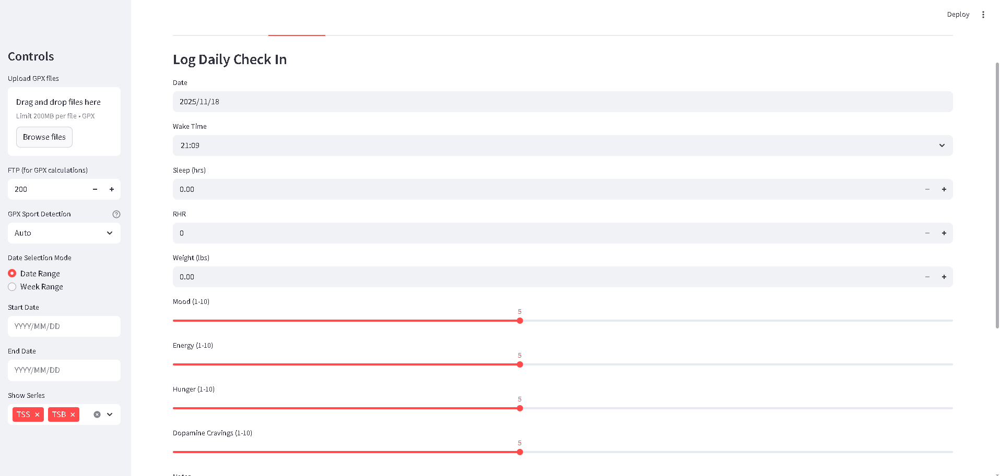
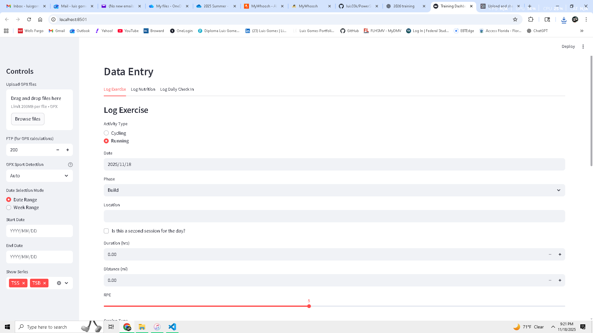
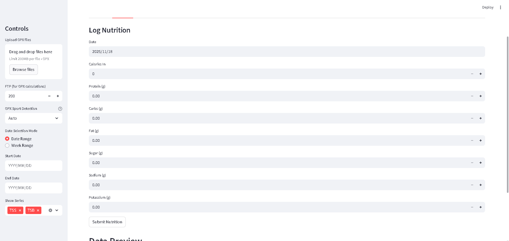
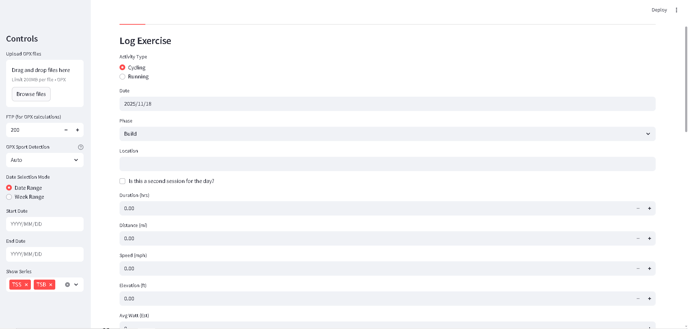

# Training Dashboard / Athlete Analytics Dashboard

A Streamlit web app for analyzing endurance training data, inspired by TrainingPeaks-style dashboards. This project extends my Excel-based workflow into a scalable analytics platform with advanced metrics, GPX parsing, and interactive visualizations.

---

## 📌 Project Goal

The goal is to build a fully modular **Python training analytics system** that eventually becomes a deployable web platform for athletes.  
This system expands on my current Excel pipeline and aims to:

- Parse **GPX files** (Garmin/Strava style)
- Compute reliable **cycling & running TSS, IF, KJ, Watts/kg**, HR/power zone metrics
- Track **sleep, recovery, carbs, sodium intake**
- Generate **interactive trending graphs** for performance and fatigue
- Mimic TrainingPeaks metrics while remaining fully local and customizable
- Evolve into a **public web dashboard / SaaS tool**

---

## 🚀 Features

- Load **master Excel logs**
- Parse **GPX ride/run files**
- Compute:
  - TSS, IF, NP
  - KJ & calorie burn
  - Watts/kg
  - Running TSS (pace‑based)
- Recovery scoring using **sleep + TSB**
- Plotly visualizations:
  - TSS/CTL/ATL/TSB charts
  - Sleep trends
  - Carbs & sodium intake patterns
  - Power, speed, HR analysis
- Modular structure for advanced expansion

---

## 🛠️ Installation

1. Clone the repo:
```bash
git clone https://github.com/luis33k/PowerSummit.git
cd training-dashboard
````

2. Install dependencies:

```bash
pip install -r requirements.txt
```

3. Run the app:

```bash
streamlit run app.py
```

---

## 📁 File Structure

* `app.py` — Main Streamlit interface
* `data_handler.py` — Excel + GPX loading logic
* `metrics.py` — TSS, IF, NP, HR/power zone calculations
* `plots.py` — Plotly chart functions
* `utils.py` — Recovery scoring, helpers, formatting
* `data/master_log.xlsx` — Example dataset

---

## 🧪 Sample Data

The sample `master_log.xlsx` includes:

* Cycling and running sessions
* Columns for:

  * Date
  * Activity Type
  * Duration
  * Avg Watt
  * FTP Used
  * RPE
  * Sleep
  * Carbs
  * Sodium
  * HR, Cadence, Distance

Used to validate metric calculations and test dashboard features.

---

## 🗺️ Roadmap

### **Phase 1 — Core Metrics (Complete)**

* Excel ingestion
* TSS/IF/KJ calculations
* Basic plots

### **Phase 2 — Streamlit Dashboard (In Progress)**

* UI pages
* Filters & interactions
* GPX parsing

### **Phase 3 — Athlete Insights (Upcoming)**

* Recovery models
* Weekly summaries
* Nutrition charts

### **Phase 4 — Deployment (Future)**

* Public beta
* Multi-user version
* API for data upload

---

## 🖼️ Screenshots







---

## 🤝 Contribution

This is currently a **solo project**, but contributions, testing, and feedback are welcome.

---

## © Copyright

**© 2025 Luis G. All Rights Reserved.**

No part of this repository may be copied, reproduced, distributed, or modified without explicit written permission from the owner.

If you want to open-source it later, the license can be changed.

---

## 📝 License

This project is currently **NOT open-source**
and falls under **All Rights Reserved** protection.

```